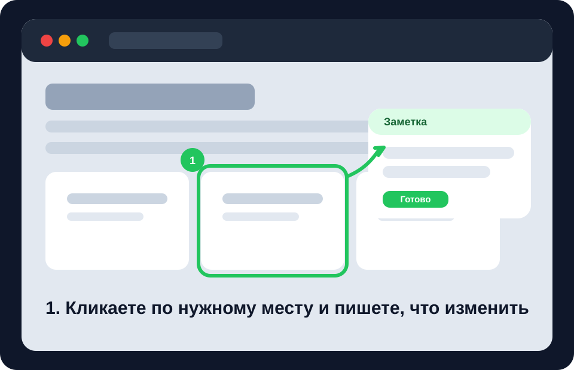
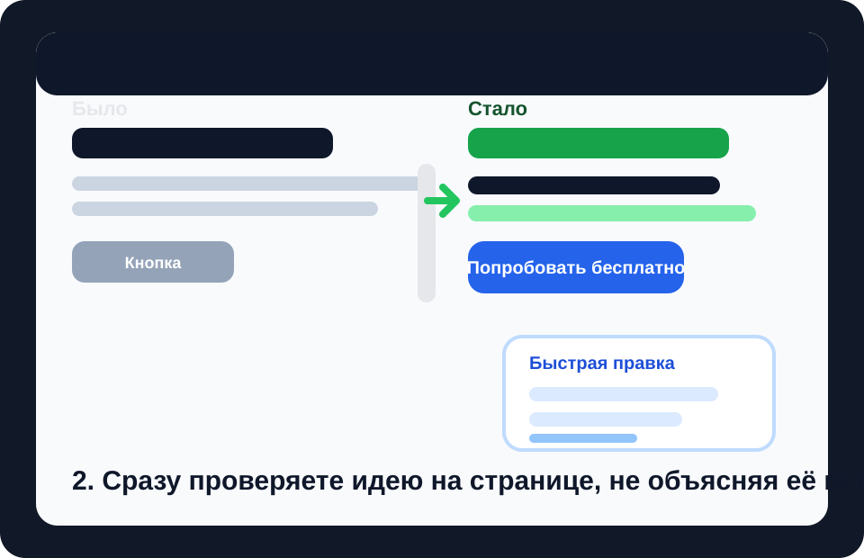
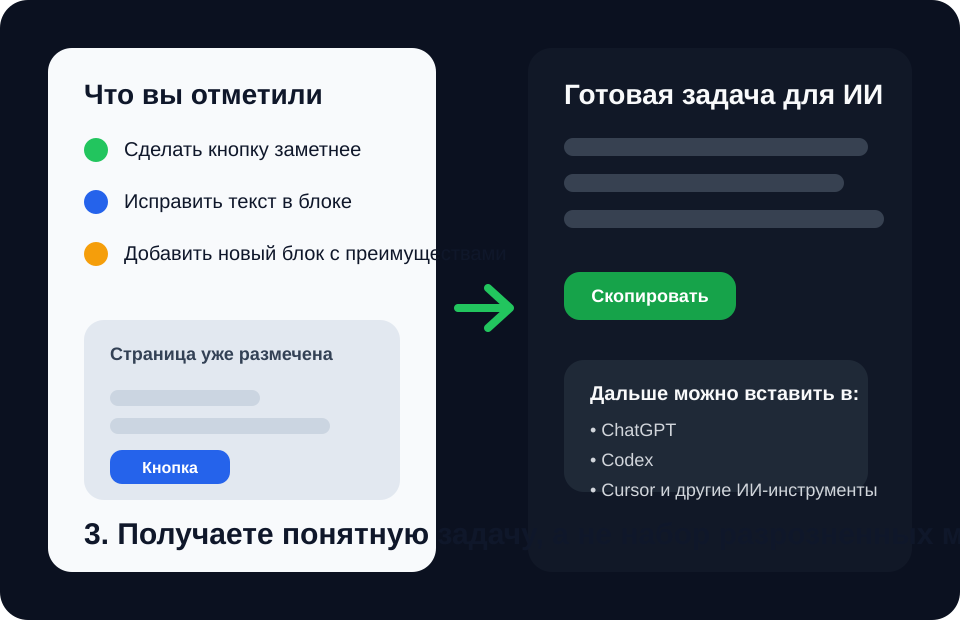

[English](README.en.md) | [Русский](README.md)

# AI Annotator

A simple browser extension that helps you show AI **what exactly needs to be changed on a website**.

Instead of writing long explanations, you open a page, click the places you care about, leave notes, quickly try visual changes right on the page if needed, and copy a ready-made instruction for AI.

In plain English: it lets you tell an agent not "make this prettier," but "change this block like this, add a new one here, and fix the text here."

## What it looks like

| 1. Show what to change | 2. Try changes right away | 3. Copy a ready-made task |
| --- | --- | --- |
|  |  |  |

## Quick start

1. Download or clone this repository.
2. Open `chrome://extensions/` in Chrome.
3. Turn on `Developer mode`.
4. Click `Load unpacked`.
5. Select the project folder.
6. Open the page you want and turn the extension on.

After that, a panel will appear on the page. That is where everything happens.

## What problem it solves

The extension helps you work with any page you have open in the browser.

With it, you can:

- point to the exact element that should be changed
- leave a clear note for AI
- test an idea right on the page without jumping into code first
- add a missing block as a rough draft
- collect all comments into one ready-to-use instruction

The result is simple: it becomes easier for you to explain the task, and easier for AI to understand what you want.

## Why it is useful

This is especially handy when you:

- want to improve a website but do not know how to describe the task clearly
- work with an AI agent and are tired of writing long prompts by hand
- want to show a design or copy change directly on the live page
- want to sketch a new block before building it for real
- want to test ideas before sending them into development

## How it works

The whole flow is very simple.

### 1. Open a page

Go to the site or screen you want to improve.

### 2. Mark the places you care about

Then you can:

- click an element and leave a comment
- quickly adjust text or appearance right on the page
- insert a template for a new block as a draft

### 3. Copy the result

When everything is ready, click the copy button and get a ready-made task for your AI agent.  
You can paste it into ChatGPT, Codex, Cursor, or any other tool you use.

## What you can do inside

### Leave notes

This is the simplest mode.

You click a button, card, heading, or any other element and write what should happen to it. For example:

- "Make this button more noticeable"
- "Add a short explanation here"
- "This block feels too crowded"

### Try changes right on the page

You can quickly test an idea without long explanations:

- change text
- move an element
- resize it
- adjust color or spacing

This is useful when showing something once is easier than explaining it five times.

### Add missing blocks

If something is missing from the page, you can insert a rough draft:

- cards
- a banner
- a benefits section
- a form
- a gallery
- an FAQ block and other presets

This is not the final design. It is a clear draft that you can later hand off to AI for implementation.

### Turn everything into one instruction

The extension collects your notes and edits into one clear piece of text.  
Instead of scattered thoughts, you get one complete task.

## Where this is especially useful

### For a site owner

You can quickly show what you want improved without understanding code or layout.

### For someone new to AI

If you are just starting to work with agents, this removes the hardest part: having to formulate everything from scratch.

### For a designer, manager, or marketer

You can show changes on the real page and hand the result to a developer or an AI tool.

### For a developer

You can gather context faster and avoid manually explaining which change belongs to which part of the page.

## What is important to understand

- The extension **does not permanently change the site by itself**.
- It helps you **show, sketch, and collect the task**.
- After that, you pass the result to AI or to a developer.

So this is not a "magic button that instantly finishes your website."  
It is a practical bridge between the idea in your head and a clear task someone can execute.

## When this really shines

If you have ever thought:

- "I know what I want to change, but I cannot describe it clearly"
- "AI keeps doing the wrong thing because my prompt is too vague"
- "I just want to point at the page and show what should change"

then this extension is built exactly for that situation.

## The short version in one sentence

**AI Annotator is an extension that helps you show AI exactly what should change on a page, instead of explaining everything from scratch in words.**
